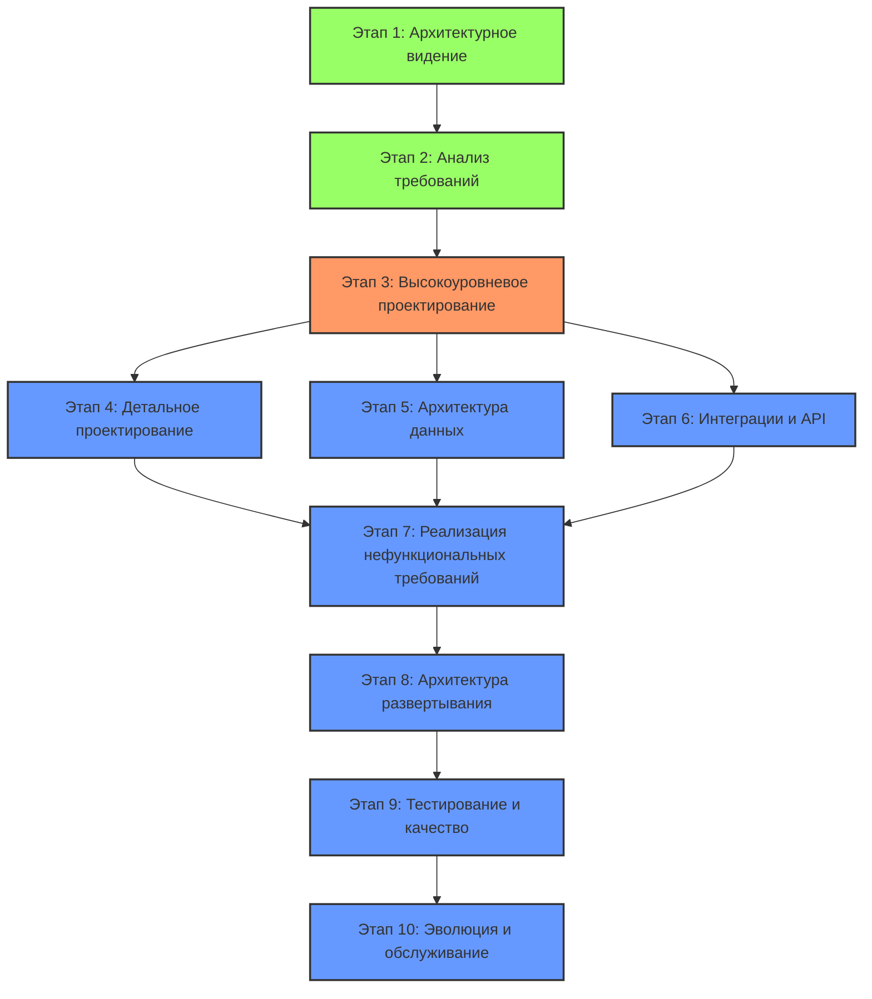
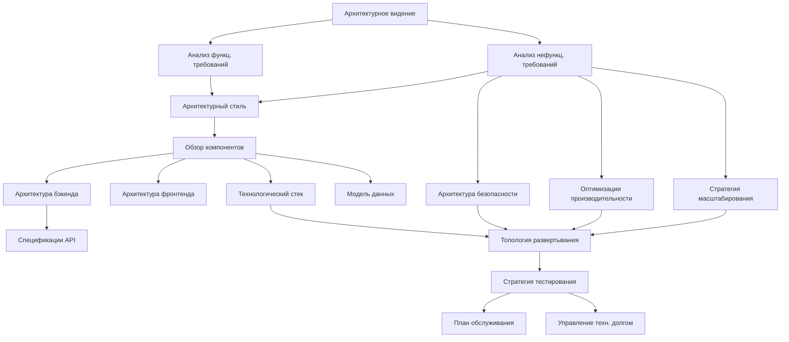
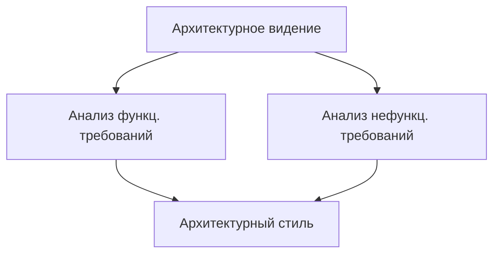
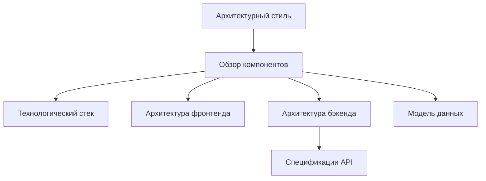
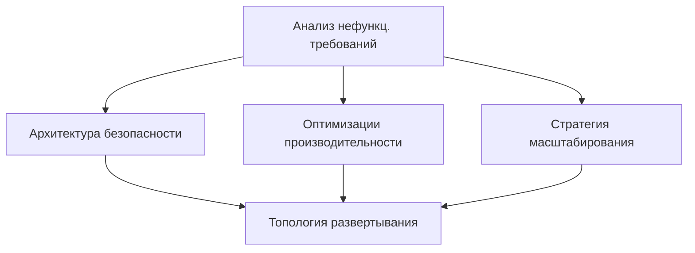
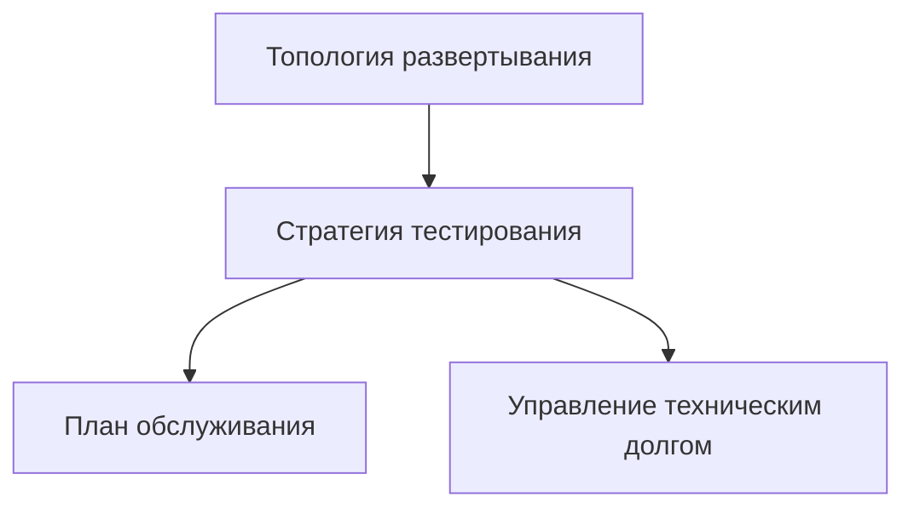
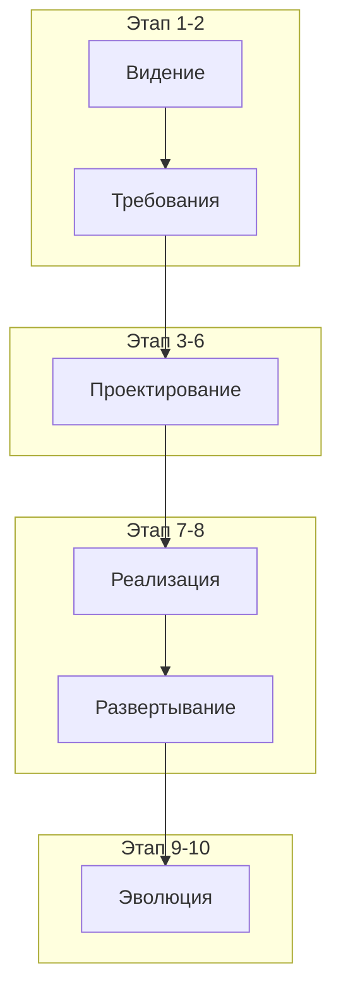

# Схема зависимостей архитектурной документации

Ниже представлена схема зависимостей между этапами и ключевыми документами архитектурной документации в формате Mermaid. Эта схема демонстрирует, как различные артефакты связаны между собой и в какой последовательности они должны разрабатываться.
## Диаграмма зависимостей между этапами



##  диаграмма зависимостей между ключевыми документами



## Диаграмма структуры каталогов

```mermaid
graph TD
    Root[architecture-docs] --> D1[01-vision]
    Root --> D2[02-requirements-analysis]
    Root --> D3[03-high-level-design]
    Root --> D4[04-detailed-design]
    Root --> D5[05-data-architecture]
    Root --> D6[06-integration]
    Root --> D7[07-nfr-implementation]
    Root --> D8[08-deployment]
    Root --> D9[09-testing]
    Root --> D10[10-evolution]
    Root --> Assets[assets]
    
    D1 --> F11[architecture-vision.md]
    D1 --> F12[architectural-principles.md]
    
    D2 --> F21[functional-requirements-analysis.md]
    D2 --> F22[non-functional-requirements-analysis.md]
    D2 --> F23[constraints-and-assumptions.md]
    
    D3 --> F31[system-context.md]
    D3 --> F32[architectural-style.md]
    D3 --> F33[component-overview.md]
    D3 --> F34[technology-stack.md]
    
    D4 --> F41[frontend-architecture.md]
    D4 --> F42[backend-architecture.md]
    D4 --> F43[component-interactions.md]
    D4 --> D41[module-specifications]
    
    D5 --> F51[data-model.md]
    D5 --> F52[database-design.md]
    D5 --> F53[data-flows.md]
    D5 --> F54[data-migration-strategy.md]
    
    D6 --> F61[api-specifications.md]
    D6 --> F62[integration-patterns.md]
    D6 --> F63[external-dependencies.md]
    
    D7 --> F71[security-architecture.md]
    D7 --> F72[performance-optimizations.md]
    D7 --> F73[scalability-strategy.md]
    D7 --> F74[availability-design.md]
    
    D8 --> F81[deployment-topology.md]
    D8 --> F82[infrastructure-requirements.md]
    D8 --> F83[ci-cd-pipeline.md]
    D8 --> F84[environment-configuration.md]
    
    D9 --> F91[testing-strategy.md]
    D9 --> F92[test-environments.md]
    D9 --> F93[quality-gates.md]
    
    D10 --> F101[versioning-strategy.md]
    D10 --> F102[maintenance-plan.md]
    D10 --> F103[technical-debt-management.md]
    
    Assets --> A1[diagrams]
    Assets --> A2[models]
    Assets --> A3[references]
```



## Дополнительные диаграммы для детализации ключевых зависимостей

Для лучшего понимания зависимостей, разделим ключевые взаимосвязи на несколько более простых диаграмм:

## Диаграмма 1: От видения к архитектурному стилю 


## Диаграмма 2: От архитектурного стиля к детальному дизайну 



## Диаграмма 3: От требований к безопасности и производительности



## Диаграмма 4: От развертывания к эволюции



## Общая схема зависимостей 



Эти диаграммы представлены в максимально упрощенной форме без использования нумерации, списков или сложного форматирования, чтобы избежать проблемы "Unsupported markdown: list". Они сохраняют ключевые зависимости между документами на разных этапах архитектурной разработки.

Важно отметить, что полная структура зависимостей более детальна и комплексна, но эти упрощенные диаграммы помогают понять основные взаимосвязи между документами и этапами.


# Структура архитектурной документации на основе PRD

Основываясь на предоставленном шаблоне PRD, я предлагаю следующую структуру архитектурной документации, разделенную на логические этапы. Каждый этап будет представлен отдельным файлом в соответствующем каталоге.

## Структура каталогов

```
architecture-docs/
├── 01-vision/
│   ├── architecture-vision.md
│   └── architectural-principles.md
├── 02-requirements-analysis/
│   ├── functional-requirements-analysis.md
│   ├── non-functional-requirements-analysis.md
│   └── constraints-and-assumptions.md
├── 03-high-level-design/
│   ├── system-context.md
│   ├── architectural-style.md
│   ├── component-overview.md
│   └── technology-stack.md
├── 04-detailed-design/
│   ├── frontend-architecture.md
│   ├── backend-architecture.md
│   ├── component-interactions.md
│   └── module-specifications/
│       ├── module-1.md
│       ├── module-2.md
│       └── ...
├── 05-data-architecture/
│   ├── data-model.md
│   ├── database-design.md
│   ├── data-flows.md
│   └── data-migration-strategy.md
├── 06-integration/
│   ├── api-specifications.md
│   ├── integration-patterns.md
│   └── external-dependencies.md
├── 07-nfr-implementation/
│   ├── security-architecture.md
│   ├── performance-optimizations.md
│   ├── scalability-strategy.md
│   └── availability-design.md
├── 08-deployment/
│   ├── deployment-topology.md
│   ├── infrastructure-requirements.md
│   ├── ci-cd-pipeline.md
│   └── environment-configuration.md
├── 09-testing/
│   ├── testing-strategy.md
│   ├── test-environments.md
│   └── quality-gates.md
├── 10-evolution/
│   ├── versioning-strategy.md
│   ├── maintenance-plan.md
│   └── technical-debt-management.md
└── assets/
    ├── diagrams/
    ├── models/
    └── references/
```

## Описание этапов и соответствующих файлов

### Этап 1: Архитектурное видение и стратегия

Файлы в каталоге `01-vision/`:

- **architecture-vision.md**: 
  - Обзор архитектурного подхода
  - Связь с бизнес-целями из PRD (разделы 2, 3.2, 5.1)
  - Основные архитектурные решения и их обоснование

- **architectural-principles.md**:
  - Ключевые принципы, которыми руководствуется архитектура
  - Стандарты и методологии, которые будут использоваться

### Этап 2: Анализ требований

Файлы в каталоге `02-requirements-analysis/`:

- **functional-requirements-analysis.md**:
  - Анализ функциональных требований из PRD (раздел 6)
  - Архитектурные имплементации для пользовательских сценариев
  - Критические пути функциональности

- **non-functional-requirements-analysis.md**:
  - Анализ нефункциональных требований из PRD (раздел 7)
  - Определение ключевых метрик и KPI для архитектуры

- **constraints-and-assumptions.md**:
  - Технические ограничения
  - Организационные ограничения
  - Допущения, сделанные при проектировании

### Этап 3: Высокоуровневое проектирование

Файлы в каталоге `03-high-level-design/`:

- **system-context.md**:
  - Контекстная диаграмма системы
  - Внешние системы и интеграции
  - Границы системы

- **architectural-style.md**:
  - Выбор архитектурного стиля (микросервисы, монолит и т.д.)
  - Обоснование выбора
  - Основные шаблоны проектирования

- **component-overview.md**:
  - Основные компоненты системы и их взаимодействие
  - Диаграммы компонентов
  - Распределение ответственности

- **technology-stack.md**:
  - Технологический стек (соответствует разделу 9.1 PRD)
  - Обоснование выбора технологий
  - Версии и совместимость

### Этап 4: Детальное проектирование компонентов

Файлы в каталоге `04-detailed-design/`:

- **frontend-architecture.md**:
  - Архитектура клиентской части
  - Структура компонентов UI
  - Управление состоянием

- **backend-architecture.md**:
  - Архитектура серверной части
  - Структура API
  - Бизнес-логика и сервисы

- **component-interactions.md**:
  - Взаимодействия между компонентами
  - Последовательности вызовов
  - Асинхронные взаимодействия

- **module-specifications/**: Папка с детальными спецификациями каждого модуля

### Этап 5: Архитектура данных

Файлы в каталоге `05-data-architecture/`:

- **data-model.md**:
  - Логическая модель данных
  - Сущности и их связи
  - Соответствие бизнес-доменам

- **database-design.md**:
  - Физическая модель данных
  - Схемы баз данных
  - Индексы и оптимизации

- **data-flows.md**:
  - Потоки данных в системе
  - ETL-процессы
  - Управление состоянием данных

- **data-migration-strategy.md**:
  - Стратегия миграции данных
  - Скрипты миграции
  - Обратная совместимость

### Этап 6: Интеграции и API

Файлы в каталоге `06-integration/`:

- **api-specifications.md**:
  - Спецификации API (REST, GraphQL и т.д.)
  - Документация API
  - Версионирование API

- **integration-patterns.md**:
  - Паттерны интеграции
  - Синхронные и асинхронные взаимодействия
  - Обработка ошибок

- **external-dependencies.md**:
  - Внешние зависимости и сервисы (из раздела 9.2 PRD)
  - Контракты с внешними системами
  - Стратегии резервирования

### Этап 7: Реализация нефункциональных требований

Файлы в каталоге `07-nfr-implementation/`:

- **security-architecture.md**:
  - Архитектура безопасности
  - Аутентификация и авторизация
  - Защита данных и коммуникаций

- **performance-optimizations.md**:
  - Оптимизации производительности
  - Кэширование
  - Управление ресурсами

- **scalability-strategy.md**:
  - Горизонтальное и вертикальное масштабирование
  - Балансировка нагрузки
  - Управление пиковыми нагрузками

- **availability-design.md**:
  - Обеспечение доступности системы
  - Отказоустойчивость
  - Стратегии восстановления

### Этап 8: Архитектура развертывания

Файлы в каталоге `08-deployment/`:

- **deployment-topology.md**:
  - Топология развертывания
  - Диаграммы инфраструктуры
  - Среды (разработка, тестирование, продакшн)

- **infrastructure-requirements.md**:
  - Требования к инфраструктуре
  - Серверы, хранилища, сети
  - Облачные ресурсы

- **ci-cd-pipeline.md**:
  - Процесс непрерывной интеграции и доставки
  - Автоматизация сборки и развертывания
  - Стратегии релизов

- **environment-configuration.md**:
  - Конфигурации сред
  - Параметры окружения
  - Управление конфигурациями

### Этап 9: Стратегия тестирования и обеспечения качества

Файлы в каталоге `09-testing/`:

- **testing-strategy.md**:
  - Стратегия тестирования архитектуры
  - Виды тестов (нагрузочные, интеграционные и т.д.)
  - Автоматизация тестирования

- **test-environments.md**:
  - Среды тестирования
  - Управление тестовыми данными
  - Инструменты тестирования

- **quality-gates.md**:
  - Критерии качества
  - Метрики и измерения
  - Процесс приемки архитектурных решений

### Этап 10: Эволюция и обслуживание

Файлы в каталоге `10-evolution/`:

- **versioning-strategy.md**:
  - Стратегия версионирования
  - Управление совместимостью
  - Планирование релизов

- **maintenance-plan.md**:
  - План обслуживания
  - Мониторинг и логирование
  - Процедуры обновления

- **technical-debt-management.md**:
  - Управление техническим долгом
  - Процесс рефакторинга
  - Планирование архитектурных улучшений

### Дополнительные ресурсы

Каталог `assets/` содержит все дополнительные ресурсы:
- **diagrams/**: Архитектурные диаграммы (UML, C4 модель и т.д.)
- **models/**: Модели и прототипы
- **references/**: Ссылки на стандарты, шаблоны и другие ресурсы

## Связь с PRD

Эта структура архитектурной документации напрямую связана с разделами PRD:

- Разделы 2-5 PRD (Цель, Обзор продукта, Целевая аудитория, Бизнес-требования) → Этап 1 (Архитектурное видение)
- Раздел 6 PRD (Функциональные требования) → Этап 2 (Анализ требований) и Этап 4 (Детальное проектирование)
- Раздел 7 PRD (Нефункциональные требования) → Этап 7 (Реализация нефункциональных требований)
- Раздел 8 PRD (Пользовательский интерфейс) → Этап 4 (Детальное проектирование компонентов)
- Раздел 9 PRD (Технические требования) → Этапы 3, 5, 6, 8 (Высокоуровневое проектирование, Архитектура данных, Интеграции, Развертывание)
- Разделы 10-13 PRD (Планирование, Риски, Тестирование, Запуск) → Этапы 9 и 10 (Тестирование, Эволюция)

Данная структура позволяет методично разрабатывать архитектурное решение, основываясь на требованиях PRD, и обеспечивает четкую трассируемость между бизнес-требованиями и техническими решениями, как отмечается в исследовании [Figma](https://www.figma.com/resource-library/product-requirements-document/).

## Рекомендации по использованию

1. Начинайте с создания архитектурного видения, согласованного с бизнес-целями из PRD
2. Последовательно разрабатывайте каждый этап, используя итеративный подход
3. Поддерживайте связь между архитектурной документацией и PRD, обновляя одну при изменении другой
4. Используйте стандартные нотации для диаграмм (UML, C4, ArchiMate) для обеспечения понятности
5. Регулярно пересматривайте и обновляйте документацию по мере эволюции проекта, как рекомендуется в [Wikipedia](https://en.wikipedia.org/wiki/Product_requirements_document)

Данная структура обеспечивает всестороннее описание архитектуры системы и служит основой для эффективной коммуникации между всеми заинтересованными сторонами проекта.
