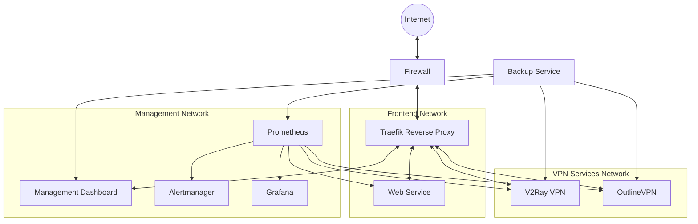

# Secure VPN Service

A comprehensive, secure, and resilient VPN solution with enhanced privacy features, traffic obfuscation, and robust monitoring.

## Overview

This VPN service is designed to provide secure, private access to the internet through multiple tunneling protocols while evading detection and censorship. The system uses Docker containers for isolation, Traefik for secure traffic routing, and implements multiple VPN protocols (V2Ray and OutlineVPN/Shadowsocks) with advanced traffic obfuscation.

## Architecture

## Key Features

- **Multiple VPN Protocols**: V2Ray (VMess) and OutlineVPN (Shadowsocks) for versatile connectivity options
- **Traffic Obfuscation**: Advanced traffic masking to evade deep packet inspection (DPI) and censorship
- **Security Hardening**: Comprehensive system hardening, including firewall rules, fail2ban, and AppArmor
- **Network Isolation**: Docker networks for security separation between components
- **Automated Monitoring**: Prometheus, Alertmanager, and Grafana for real-time monitoring and alerts
- **Management Interface**: Web-based admin dashboard for user management and system monitoring
- **Automated Backup**: Scheduled encrypted backups of configuration and data
- **TLS Encryption**: Automatic TLS certificate management via Let's Encrypt
- **Legitimate-Looking Frontend**: Cover website to make the VPN service less conspicuous

## Directory Structure

- **/*.sh**: Setup, firewall, maintenance, and security check scripts
- **/.env**: Environment variables for configuration
- **/docker-compose.yml**: Main service definition file
- **/traefik/**: Traefik reverse proxy configuration
- **/v2ray/**: V2Ray VPN service configuration
- **/outline/**: OutlineVPN (Shadowsocks) configuration
- **/web/**: Cover website files
- **/management/**: Administration dashboard configuration
- **/monitoring/**: Prometheus, Alertmanager, and Grafana configurations

## Quick Start

1. Ensure your server meets the [requirements](INSTALL.md#requirements)
2. Clone this repository to your server
3. Run the setup script: `sudo ./setup.sh`
4. Configure firewall rules: `sudo ./firewall.sh`
5. Update the `.env` file with your domain and credentials
6. Start the services: `docker-compose up -d`
7. Verify the installation: `./security-checks.sh`

For detailed installation instructions, see [INSTALL.md](INSTALL.md).

## Documentation

- [Installation Guide](INSTALL.md): Detailed setup and deployment instructions
- [Administration Guide](ADMIN-GUIDE.md): User management, maintenance, and troubleshooting
- [Security Documentation](SECURITY.md): Security features, best practices, and threat model
- [Client Setup](client-setup.md): Instructions for end-users to connect to the VPN

## Requirements

- **Hardware**: 2+ CPU cores, 4GB+ RAM, 40GB+ storage
- **OS**: Ubuntu 20.04 LTS or newer
- **Network**: Public IP address, ability to open ports 80, 443
- **Domain**: Valid domain name with DNS pointing to your server
- **Docker**: Docker Engine and Docker Compose

For detailed requirements and compatibility information, see the [Installation Guide](INSTALL.md#requirements).

## License

This project is proprietary and confidential. Unauthorized copying, transferring, or reproduction of the contents of this project, via any medium, is strictly prohibited.