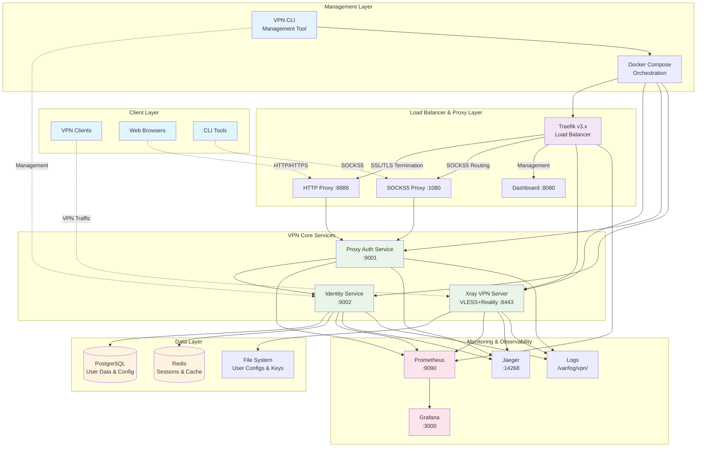
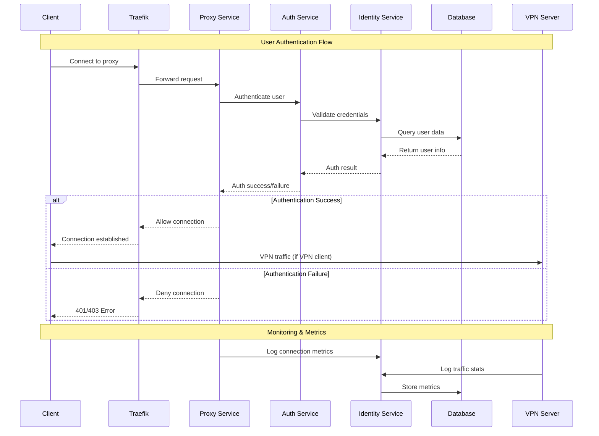

# System Architecture

## High-Level System Architecture



## Service Communication Flow



## Container Architecture

```mermaid
graph TB
    subgraph "Docker Host"
        subgraph "vpn-network (Docker Network)"
            subgraph "Traefik Container"
                TR[Traefik Process<br/>:80, :443, :8080]
            end
            
            subgraph "VPN Server Container"
                XR[Xray-core Process<br/>:8443]
                XC[Config Files<br/>/etc/xray/]
            end
            
            subgraph "Proxy Auth Container"
                PA[Auth Service<br/>:9001]
                PC[Proxy Config<br/>/etc/proxy/]
            end
            
            subgraph "Identity Service Container"
                IS[Identity API<br/>:9002]
                IC[User Data<br/>/opt/vpn/users/]
            end
            
            subgraph "Database Containers"
                PG[PostgreSQL<br/>:5432]
                RD[Redis<br/>:6379]
            end
            
            subgraph "Monitoring Containers"
                PR[Prometheus<br/>:9090]
                GR[Grafana<br/>:3000]
                JG[Jaeger<br/>:14268]
            end
        end
        
        subgraph "Host Volumes"
            V1[/opt/vpn/config]
            V2[/opt/vpn/users]
            V3[/opt/vpn/logs]
            V4[/opt/vpn/data]
            V5[/opt/vpn/certs]
        end
    end

    %% Volume mounts
    XC -.->|Mount| V1
    IC -.->|Mount| V2
    PG -.->|Mount| V4
    TR -.->|Mount| V5

    %% Service communication
    TR --> XR
    TR --> PA
    PA --> IS
    IS --> PG
    IS --> RD
    
    %% Monitoring
    XR --> PR
    PA --> PR
    IS --> PR
    PR --> GR
    
    style TR fill:#f3e5f5
    style XR fill:#e8f5e8
    style PA fill:#e8f5e8
    style IS fill:#e8f5e8
    style PG fill:#fff3e0
    style RD fill:#fff3e0
    style PR fill:#fce4ec
    style GR fill:#fce4ec
```