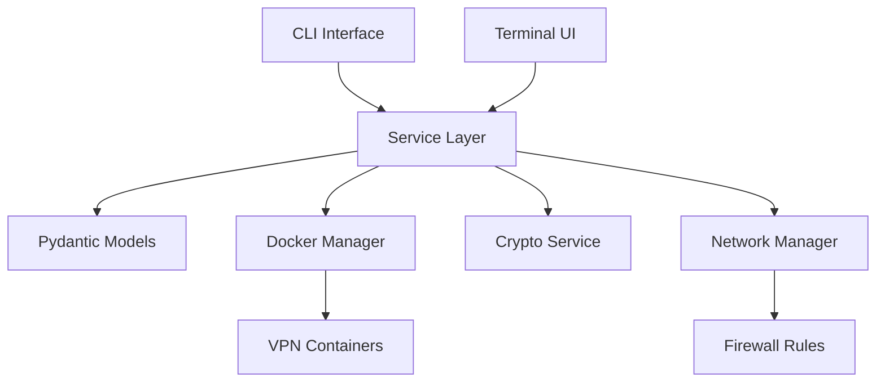

# VPN Manager - Python Implementation

A comprehensive VPN management system built with Python, Pydantic, and modern TUI technologies.

## Overview

VPN Manager is a powerful, type-safe VPN management solution that provides:

- **Multi-Protocol Support**: VLESS+Reality, Shadowsocks/Outline, WireGuard
- **Modern CLI**: Rich command-line interface with multiple output formats
- **Terminal UI**: Interactive TUI built with Textual
- **Docker Integration**: Containerized VPN servers with health monitoring
- **Proxy Services**: HTTP/HTTPS and SOCKS5 proxy servers
- **Type Safety**: Built with Pydantic for data validation and type safety

## Quick Start

```bash
# Install VPN Manager
pip install vpn-manager

# Create your first user
vpn users create alice --protocol vless --email alice@example.com

# Install a VPN server
vpn server install --protocol vless --port 8443 --name main-server

# Start the TUI
vpn tui
```

## Architecture



## Key Features

### 🔐 Multi-Protocol VPN Support

- **VLESS+Reality**: Modern protocol with domain fronting
- **Shadowsocks**: High-performance proxy protocol
- **WireGuard**: Next-generation VPN protocol

### 🖥️ Modern Interfaces

- **Rich CLI**: Beautiful command-line interface with colors and formatting
- **Terminal UI**: Full-featured TUI with real-time monitoring
- **Multiple Formats**: JSON, YAML, table, and plain text output

### 🐋 Docker Integration

- **Containerized Servers**: All VPN servers run in Docker containers
- **Health Monitoring**: Automatic health checks and recovery
- **Resource Management**: CPU and memory monitoring

### 🔒 Security Features

- **Type Safety**: Pydantic models ensure data validation
- **Authentication**: Built-in authentication for proxy services
- **Rate Limiting**: Protection against abuse
- **Secure Defaults**: Security-first configuration

## Performance

The Python implementation delivers excellent performance:

- **Startup Time**: <100ms for CLI commands
- **Memory Usage**: <50MB for typical operations
- **Concurrent Users**: 1000+ simultaneous connections
- **Resource Efficiency**: Optimized for minimal resource usage

## Migration from Rust

If you're migrating from the Rust version, we provide:

- **Automated Migration Tools**: Convert existing configurations
- **Data Migration**: Preserve user data and settings
- **Compatibility Layer**: Gradual migration support
- **Migration Guide**: Step-by-step migration instructions

## Community and Support

- **Documentation**: Comprehensive guides and API reference
- **GitHub**: Source code and issue tracking
- **Discord**: Community chat and support
- **Discussions**: Q&A and feature requests

## License

VPN Manager is open-source software licensed under the MIT License.

---

Ready to get started? Check out our [Installation Guide](getting-started/installation.md) or dive into the [Quick Start](getting-started/quickstart.md) tutorial.