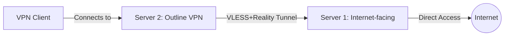

# Comprehensive Installation Guide for VLESS+Reality Tunnel with Outline VPN

This guide provides step-by-step instructions for deploying the complete VLESS+Reality tunnel setup with Outline VPN integration. Follow these steps in sequence to ensure a proper installation.

## Deployment Architecture

Our setup consists of two servers configured in a tunnel architecture:

1. **Server 1 (Tunnel Entry Point)**: Internet-facing server with direct internet access
2. **Server 2 (Outline VPN Host)**: Routes traffic through Server 1 and provides VPN service to clients



## Before You Begin

### Prerequisites

- Two servers with:
  - Ubuntu 20.04+ or Debian 10+ operating system
  - Root or sudo privileges
  - Docker installed
  - Server 1 must have unrestricted internet access
  - Server 2 must be able to reach Server 1

### System Requirements

- **Server 1**:
  - CPU: 1+ cores
  - RAM: 1GB+ recommended
  - Storage: 10GB+ free space
  
- **Server 2**:
  - CPU: 2+ cores recommended
  - RAM: 2GB+ recommended
  - Storage: 20GB+ free space

## Deployment Steps

### 1. Prepare Both Servers

On both Server 1 and Server 2, run:

```bash
# Update the system
sudo apt update
sudo apt upgrade -y

# Install essential packages
sudo apt install -y curl wget jq ufw socat iptables-persistent

# Install Docker if not already installed
sudo apt install -y docker.io
```

### 2. Deploy Basic VLESS+Reality on Server 1

First, we need to set up the basic VLESS+Reality service on Server 1:

```bash
# Clone the repository on Server 1
git clone https://github.com/yourusername/vpn.git
cd vpn

# Make scripts executable
chmod +x script/*.sh

# Run the basic VLESS+Reality setup script
sudo ./script/setup-vless-reality-server.sh
```

This will set up the base VLESS+Reality server on Server 1, which is required before configuring it as a tunnel entry point.

### 3. Configure Server 1 as Tunnel Entry Point

Once the basic VLESS+Reality service is running on Server 1, configure it as a tunnel entry point:

```bash
# On Server 1
sudo ./script/setup-vless-server1.sh
```

**IMPORTANT**: At the end of this step, you will receive connection details for Server 2, including:
- Server 1 Address
- Port
- UUID
- Account Name

These details are saved to `server2_config.txt` but should also be noted separately as you'll need them for the next step.

### 4. Configure Server 2 and Install Outline VPN

With the connection details from Server 1, set up Server 2:

```bash
# Clone the repository on Server 2
git clone https://github.com/yourusername/vpn.git
cd vpn

# Make scripts executable
chmod +x script/*.sh

# Run the Server 2 setup script with Server 1 details
sudo ./script/setup-vless-server2.sh \
  --server1-address <SERVER1_IP_OR_HOSTNAME> \
  --server1-uuid <UUID_FROM_SERVER1>
```

This script will:
1. Install and configure the VLESS+Reality client to connect to Server 1
2. Set up transparent routing for all traffic through Server 1
3. Install and configure Outline VPN to use the tunnel

At the end of the script, you'll receive a URL for the Outline Management API, which you'll use in the next step.

### 5. Configure Outline VPN Manager

1. Download and install the [Outline Manager](https://getoutline.org/get-started/#step-1) on your local computer
2. Connect to your server using the API URL provided at the end of the Server 2 setup
   - Format: `https://<SERVER2_IP>:41084/access-keys/`
3. Follow the prompts to complete Outline VPN setup
4. Create access keys for your VPN users

### 6. Test the Tunnel Connection

Verify that both servers are properly configured and the tunnel is working:

```bash
# On Server 1
sudo ./script/test-tunnel-connection.sh --server-type server1

# On Server 2
sudo ./script/test-tunnel-connection.sh --server-type server2 --server1-address <SERVER1_IP_OR_HOSTNAME>
```

The test script will check:
- Docker container status
- IP forwarding configuration
- Network connectivity
- Tunnel functionality
- Firewall rules
- On Server 2, it will also check Outline VPN status

### 7. Distribute Outline VPN Access Keys

1. In the Outline Manager, create access keys for your users
2. Share these keys securely with your users
3. Users install the [Outline Client](https://getoutline.org/get-started/#step-3) on their devices
4. Add the access key to their Outline Client to connect

## Optional Configurations

### Using an Existing Outline Installation

If you already have Outline VPN installed on Server 2, you can route it through the tunnel:

1. Set up Server 1 as a tunnel entry point (steps 1-3 above)
2. On Server 2, run:

```bash
# Clone the repository if not already done
git clone https://github.com/yourusername/vpn.git
cd vpn

# Make scripts executable
chmod +x script/*.sh

# Install the VLESS client and configure routing
sudo ./script/setup-vless-server2.sh \
  --server1-address <SERVER1_IP_OR_HOSTNAME> \
  --server1-uuid <UUID_FROM_SERVER1>

# Configure the existing Outline installation to use the tunnel
sudo ./script/route-outline-through-tunnel.sh --outline-dir /opt/outline
```

### Adding More VPN Users

To add more users to Outline VPN:

1. Open the Outline Manager
2. Connect to your server
3. Click "Add Key" to create a new access key
4. Share the access key with the new user

## Uninstallation

If you need to remove the tunnel configuration:

```bash
# On Server 1 or Server 2, depending on which you want to uninstall
sudo ./script/uninstall-vless-tunnel.sh
```

## Maintenance and Updates

### Server Updates

Regularly update both servers:

```bash
sudo apt update
sudo apt upgrade -y
```

### Docker Container Updates

Update Docker containers:

```bash
# Pull the latest v2ray image
docker pull v2fly/v2fly-core:latest

# Restart the containers
docker restart v2ray        # On Server 1
docker restart v2ray-client # On Server 2
```

### Backup Configurations

Regularly backup important configuration files:

```bash
# On Server 1
sudo cp -r /opt/v2ray /opt/v2ray.bak

# On Server 2
sudo cp -r /opt/v2ray /opt/v2ray.bak
sudo cp -r /opt/outline /opt/outline.bak
```

## Troubleshooting

For troubleshooting common issues, refer to the [Tunnel Troubleshooting Guide](tunnel-troubleshooting.md).

## Security Best Practices

1. Use SSH key authentication instead of password login
2. Keep all systems updated
3. Monitor logs regularly
4. Configure UFW/firewall to allow only necessary ports
5. Use strong, unique passwords for access keys
6. Consider implementing fail2ban for SSH protection
7. Regularly audit your server security with `security-checks-reality.sh`

## Next Steps

After completing the installation, consider:

1. Setting up regular security audits
2. Implementing monitoring for both servers
3. Configuring automated backups
4. Setting up a failover system for high availability

## References

- [VLESS+Reality Tunnel Architecture](vless-reality-tunnel-architecture.md)
- [Server 1 Setup Guide](server1-setup-guide.md)
- [Server 2 Setup Guide](server2-setup-guide.md)
- [Outline VPN Installation](outline-vpn-installation.md)
- [Tunnel Troubleshooting](tunnel-troubleshooting.md)