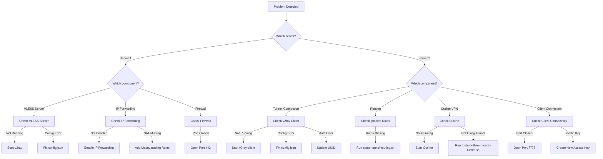

# VLESS+Reality Tunnel Troubleshooting Guide

## Overview

This guide provides solutions for common issues that may arise with the two-server VLESS+Reality tunnel setup with Outline VPN. The guide is organized by component and includes diagnostics, common problems, and their solutions.

## Diagnostic Tools

Before troubleshooting specific issues, run the included diagnostic script:

```bash
# For Server 1
sudo ./script/test-tunnel-connection.sh --server-type server1

# For Server 2
sudo ./script/test-tunnel-connection.sh --server-type server2 --server1-address YOUR_SERVER1_IP
```

This script will check:
- Docker and container status
- IP forwarding configuration
- Network connectivity
- Firewall settings
- Proxy functionality
- Outline VPN status (on Server 2)

## Server 1 Issues

### Connection Issues

**Problem**: Server 2 cannot connect to Server 1

**Diagnostics**:
```bash
# Check if the VLESS server is running
docker ps | grep v2ray

# Verify port is open
ss -tulpn | grep 443

# Check firewall status
ufw status
```

**Solutions**:
1. If the v2ray container is not running:
   ```bash
   docker start v2ray
   ```

2. If the port is not open, check your firewall settings:
   ```bash
   sudo ufw allow 443/tcp
   sudo ufw reload
   ```

3. Verify the VLESS configuration:
   ```bash
   cat /opt/v2ray/config.json
   ```
   
4. Check the v2ray logs for errors:
   ```bash
   docker logs v2ray
   ```

### IP Forwarding Issues

**Problem**: Traffic from Server 2 is not being forwarded to the internet

**Diagnostics**:
```bash
# Check if IP forwarding is enabled
cat /proc/sys/net/ipv4/ip_forward

# Verify NAT masquerading rules
sudo iptables -t nat -L POSTROUTING -v
```

**Solutions**:
1. If IP forwarding is not enabled (output is 0):
   ```bash
   echo 1 > /proc/sys/net/ipv4/ip_forward
   echo "net.ipv4.ip_forward=1" >> /etc/sysctl.conf
   sysctl -p
   ```

2. If masquerading rules are missing:
   ```bash
   # Get your internet-facing interface
   IFACE=$(ip -4 route show default | awk '{print $5}' | head -n1)
   
   # Add masquerading rule
   iptables -t nat -A POSTROUTING -o $IFACE -j MASQUERADE
   
   # Save the rules
   iptables-save > /etc/iptables/rules.v4
   ```

### User Account Issues

**Problem**: Server 2 cannot authenticate with Server 1

**Diagnostics**:
```bash
# Check if the user exists
grep "server2" /opt/v2ray/users.db
```

**Solutions**:
1. If the user doesn't exist, create it:
   ```bash
   ./manage-vless-users.sh --add --name "server2"
   ```

2. If you need to retrieve the UUID again:
   ```bash
   grep "server2" /opt/v2ray/users.db | cut -d'|' -f1
   ```

3. Update Server 2 with the correct UUID:
   ```bash
   # On Server 2
   vi /opt/v2ray/config.json
   # Update the UUID in the configuration
   docker restart v2ray-client
   ```

## Server 2 Issues

### Tunnel Connection Issues

**Problem**: Server 2 cannot establish a tunnel to Server 1

**Diagnostics**:
```bash
# Check if v2ray client is running
docker ps | grep v2ray-client

# Test the proxy connection
curl -v --connect-timeout 10 -x http://127.0.0.1:8080 https://ifconfig.me

# Check v2ray client logs
docker logs v2ray-client
```

**Solutions**:
1. If the v2ray client container is not running:
   ```bash
   docker start v2ray-client
   ```

2. If curl fails, verify the configuration:
   ```bash
   cat /opt/v2ray/config.json
   ```
   
   Check that:
   - Server 1 address is correct
   - UUID matches the one from Server 1
   - Port is correct (usually 443)
   - Reality settings (if used) are correct

3. Restart the v2ray client:
   ```bash
   docker restart v2ray-client
   ```

4. If Reality settings are being used, verify they match Server 1:
   ```bash
   # Check Server 1's public key
   # On Server 1:
   grep "privateKey\|publicKey" /opt/v2ray/config.json
   
   # Update Server 2's configuration with the correct public key
   # On Server 2:
   vi /opt/v2ray/config.json
   ```

### Routing Issues

**Problem**: Traffic is not being routed through the tunnel

**Diagnostics**:
```bash
# Check iptables NAT rules
sudo iptables -t nat -L

# Verify transparent proxy port is listening
ss -tulpn | grep 1081
```

**Solutions**:
1. If the V2RAY chain is missing:
   ```bash
   # Recreate the iptables rules
   /usr/local/bin/setup-tunnel-routing.sh
   ```

2. If the transparent proxy port is not listening, check v2ray configuration:
   ```bash
   cat /opt/v2ray/config.json
   ```
   
   Ensure it includes the transparent proxy inbound:
   ```json
   {
     "tag": "transparent-inbound",
     "port": 1081,
     "listen": "0.0.0.0",
     "protocol": "dokodemo-door",
     "settings": {
       "network": "tcp,udp",
       "followRedirect": true
     },
     "streamSettings": {
       "sockopt": {
         "tproxy": "tproxy"
       }
     }
   }
   ```

3. Restart the v2ray client:
   ```bash
   docker restart v2ray-client
   ```

### Outline VPN Issues

**Problem**: Outline VPN is not working or not routing through the tunnel

**Diagnostics**:
```bash
# Check if Outline containers are running
docker ps | grep outline

# Check Outline environment configuration
cat /opt/outline/outline-tunnel.conf

# Check if Outline is using the environment variables
docker-compose -f /opt/outline/docker-compose.yml config

# Test Outline API
curl -k https://localhost:41084/server
```

**Solutions**:
1. If Outline containers are not running:
   ```bash
   cd /opt/outline && docker-compose up -d
   ```

2. If tunnel environment variables are not configured:
   ```bash
   # Run the script to configure Outline to use the tunnel
   ./script/route-outline-through-tunnel.sh
   ```

3. If Outline is not picking up the environment variables, manually update its configuration:
   ```bash
   vi /opt/outline/docker-compose.yml
   ```
   
   Add or verify the env_file section:
   ```yaml
   services:
     watchtower:
       image: shadowbox
       env_file:
         - /opt/outline/outline-tunnel.conf
   ```

4. Restart Outline:
   ```bash
   cd /opt/outline && docker-compose down && docker-compose up -d
   ```

### Client Connection Issues

**Problem**: Clients cannot connect to Outline VPN

**Diagnostics**:
```bash
# Check if the port is open
ss -tulpn | grep 7777

# Check firewall rules
ufw status | grep 7777

# Look for connection attempts in the logs
docker logs outline-server | grep -i "error\|connection"
```

**Solutions**:
1. If the port is not open, check Outline's configuration:
   ```bash
   cat /opt/outline/docker-compose.yml
   ```

2. If the firewall is blocking connections:
   ```bash
   sudo ufw allow 7777/tcp
   sudo ufw allow 7777/udp
   sudo ufw reload
   ```

3. Check if the access keys are valid:
   ```bash
   # Via the Outline Manager
   # Or check directly in the access-keys directory
   ls -la /opt/outline/access-keys/
   ```

4. Recreate the access key in the Outline Manager if needed.

## Networking Issues

### DNS Resolution Problems

**Problem**: DNS resolution isn't working through the tunnel

**Diagnostics**:
```bash
# Test DNS resolution
curl -v --connect-timeout 10 -x http://127.0.0.1:8080 https://google.com
```

**Solutions**:
1. On Server 2, check v2ray configuration for DNS settings:
   ```bash
   vi /opt/v2ray/config.json
   ```

2. Add or update the DNS section:
   ```json
   "dns": {
     "servers": [
       "8.8.8.8",
       "8.8.4.4"
     ]
   }
   ```

3. Restart the v2ray client:
   ```bash
   docker restart v2ray-client
   ```

### Dropped Packets

**Problem**: Connections are unstable or dropping

**Diagnostics**:
```bash
# Check for dropped packets
netstat -s | grep -i drop

# Look for MTU issues
ping -M do -s 1400 SERVER1_IP
```

**Solutions**:
1. Try adjusting the MTU:
   ```bash
   # Find optimal MTU
   MTU=$(ping -M do -s 1500 SERVER1_IP 2>&1 | grep "Message too long" | awk '{print $1}' | head -1)
   # Subtract 28 for headers
   OPTIMAL_MTU=$((MTU - 28))
   
   # Set the MTU on the interface
   ifconfig INTERFACE_NAME mtu $OPTIMAL_MTU
   ```

2. Add the MTU setting to the network configuration for persistence:
   ```bash
   vi /etc/network/interfaces
   # Add: mtu OPTIMAL_MTU to the interface configuration
   ```

## Docker Issues

### Container Startup Problems

**Problem**: Docker containers won't start or keep restarting

**Diagnostics**:
```bash
# Check container status
docker ps -a

# Check container logs
docker logs v2ray-client
docker logs outline-server
```

**Solutions**:
1. If there's a configuration error:
   ```bash
   # Fix the configuration file
   vi /opt/v2ray/config.json
   # Or
   vi /opt/outline/docker-compose.yml
   
   # Try starting the container again
   docker start v2ray-client
   ```

2. If there's a port conflict:
   ```bash
   # Find what's using the port
   ss -tulpn | grep 1081  # For v2ray transparent proxy
   ss -tulpn | grep 7777  # For Outline VPN
   
   # Stop the conflicting service or change the port in configuration
   ```

3. If Docker itself is having issues:
   ```bash
   systemctl restart docker
   ```

## Firewall Issues

### Blocked Connections

**Problem**: Firewall is blocking necessary connections

**Diagnostics**:
```bash
# Check UFW status
ufw status

# Look for dropped packets in the kernel log
dmesg | grep DROP
```

**Solutions**:
1. Allow necessary ports on Server 1:
   ```bash
   sudo ufw allow 443/tcp
   sudo ufw reload
   ```

2. Allow necessary ports on Server 2:
   ```bash
   sudo ufw allow 7777/tcp
   sudo ufw allow 7777/udp
   sudo ufw allow 41084/tcp  # For Outline API
   sudo ufw reload
   ```

3. Check if forwarding is allowed in UFW:
   ```bash
   vi /etc/default/ufw
   # Ensure: DEFAULT_FORWARD_POLICY="ACCEPT"
   
   # Restart UFW
   sudo ufw disable && sudo ufw enable
   ```

## Performance Issues

### Slow Connections

**Problem**: Connections through the tunnel are slow

**Diagnostics**:
```bash
# Test download speed directly
curl -o /dev/null http://speedtest.wdc01.softlayer.com/downloads/test100.zip

# Test download speed through the tunnel
curl -x http://127.0.0.1:8080 -o /dev/null http://speedtest.wdc01.softlayer.com/downloads/test100.zip
```

**Solutions**:
1. Check server load:
   ```bash
   top
   ```

2. Consider upgrading Server 1 if it's overloaded.

3. Implement traffic shaping to ensure fair bandwidth distribution:
   ```bash
   # Install traffic control tools
   apt install -y tc
   
   # Set up basic traffic shaping
   tc qdisc add dev eth0 root handle 1: htb default 10
   tc class add dev eth0 parent 1: classid 1:10 htb rate 50mbit
   ```

4. Check for network congestion between Server 1 and Server 2:
   ```bash
   mtr SERVER1_IP
   ```

## Advanced Troubleshooting

### Checking Protocol Issues

**Problem**: VLESS+Reality protocol is not working correctly

**Solutions**:
1. Verify that the Reality fingerprint is working:
   ```bash
   # On Server 2
   docker exec -it v2ray-client v2ray test tls -server SERVER1_IP:443 -fingerprint chrome
   ```

2. If there are issues, try a different fingerprint:
   ```bash
   # Update config.json on both servers
   # Common alternatives: firefox, safari, ios, android, edge
   ```

### Traffic Analysis

**Problem**: Need to verify traffic patterns or debug connection issues

**Solutions**:
1. Use tcpdump to analyze traffic:
   ```bash
   # Install tcpdump
   apt install -y tcpdump
   
   # Capture traffic on the VLESS port
   tcpdump -i any -nn port 443 -w capture.pcap
   
   # Analyze specific connections
   tcpdump -i any -nn host SERVER1_IP
   ```

2. Use Wireshark to analyze the capture file for deeper inspection.

## Quick Reference Commands

### Server 1 Essential Commands

```bash
# Restart v2ray server
docker restart v2ray

# Check VLESS users
cat /opt/v2ray/users.db

# Add a new VLESS user
./manage-vless-users.sh --add --name "new-server"

# Check firewall status
ufw status

# Check masquerading rules
iptables -t nat -L POSTROUTING -v
```

### Server 2 Essential Commands

```bash
# Restart v2ray client (tunnel)
docker restart v2ray-client

# Restart Outline VPN
cd /opt/outline && docker-compose down && docker-compose up -d

# Test tunnel connection
curl -v --connect-timeout 10 -x http://127.0.0.1:8080 https://ifconfig.me

# Reset routing rules
/usr/local/bin/setup-tunnel-routing.sh

# Check Outline status
curl -k https://localhost:41084/server
```

## System Recovery

### Complete Tunnel Reset

If everything else fails, you can reset the tunnel setup:

**On Server 2**:
```bash
# Stop containers
docker stop v2ray-client
docker rm v2ray-client

# Reconfigure the tunnel
./script/setup-vless-server2.sh --server1-address SERVER1_IP --server1-uuid SERVER1_UUID

# Reconfigure Outline to use the tunnel
./script/route-outline-through-tunnel.sh
```

**On Server 1**:
```bash
# Reset the user account
./manage-vless-users.sh --remove --name "server2"
./manage-vless-users.sh --add --name "server2"

# Get the new UUID for Server 2
grep "server2" /opt/v2ray/config.json
```

## Conditional Troubleshooting Flowchart



## Monitoring and Maintenance

To prevent issues, set up regular monitoring:

### Basic Monitoring Script

Create a file called `monitor-tunnel.sh`:

```bash
#!/bin/bash

# Server type (server1 or server2)
SERVER_TYPE=$1

# Function to check services and send alerts
check_services() {
    # Check Docker containers
    if [ "$SERVER_TYPE" == "server1" ]; then
        if ! docker ps | grep -q v2ray; then
            echo "[ALERT] v2ray container is not running on Server 1"
        fi
    else
        if ! docker ps | grep -q v2ray-client; then
            echo "[ALERT] v2ray-client container is not running on Server 2"
        fi
        
        if ! docker ps | grep -q outline-server; then
            echo "[ALERT] outline-server container is not running on Server 2"
        fi
    fi
    
    # Check IP forwarding
    if [ "$(cat /proc/sys/net/ipv4/ip_forward)" != "1" ]; then
        echo "[ALERT] IP forwarding is disabled"
    fi
    
    # Test connectivity (Server 2 only)
    if [ "$SERVER_TYPE" == "server2" ]; then
        if ! curl -s --connect-timeout 5 -x http://127.0.0.1:8080 https://ifconfig.me > /dev/null; then
            echo "[ALERT] Tunnel connection test failed"
        fi
    fi
}

# Run checks
check_services
```

Schedule this script to run regularly using cron:

```bash
# Run every hour
echo "0 * * * * /path/to/monitor-tunnel.sh server2 >> /var/log/tunnel-monitor.log 2>&1" | crontab -
```

## References

- [VLESS+Reality Tunnel Architecture](vless-reality-tunnel-architecture.md)
- [Server 1 Setup Guide](server1-setup-guide.md)
- [Server 2 Setup Guide](server2-setup-guide.md)
- [Outline VPN Installation Guide](outline-vpn-installation.md)