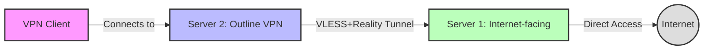

# VLESS+Reality Tunnel Architecture with Outline VPN

## Overview

This document provides a comprehensive overview of the two-server VLESS+Reality tunnel setup with Outline VPN. This architecture enables secure VPN access through a tunnel between two servers, where one server has direct internet access and the other provides VPN services through that tunnel.

## System Architecture

## Components

1. **Server 1 (Internet-facing)**
   - Has direct access to the internet
   - Runs VLESS+Reality protocol server
   - Acts as the tunnel entry point
   - Forwards all traffic from Server 2 to the internet
   - Configured with IP forwarding and NAT masquerading

2. **Server 2 (VPN Provider)**
   - May have limited or censored internet access
   - Connects to Server 1 via VLESS+Reality tunnel
   - Runs Outline VPN server for client connections
   - Routes all Outline VPN client traffic through the tunnel to Server 1

3. **VLESS+Reality Tunnel**
   - Secure connection between Server 2 and Server 1
   - Uses VLESS protocol with Reality TLS fingerprinting for enhanced security
   - Resistant to deep packet inspection and blocking
   - Configured as a transparent proxy on Server 2

4. **Outline VPN**
   - Shadowsocks-based VPN solution
   - Provides secure connections for end users
   - Easy-to-use client apps for various platforms
   - All client traffic is routed through Server 2 and then through the tunnel to Server 1

## Traffic Flow

1. VPN clients connect to Server 2 (Outline VPN) on port 7777 (default)
2. Server 2 receives the traffic and routes it through the local VLESS client
3. VLESS client on Server 2 forwards the traffic through the Reality tunnel to Server 1
4. Server 1 receives the traffic via its VLESS+Reality server and forwards it to the internet
5. Return traffic follows the reverse path

## Network Configuration

- **Server 1**: 
  - IP forwarding enabled
  - NAT masquerading for traffic from Server 2
  - Firewall configured to allow VLESS+Reality traffic

- **Server 2**:
  - IP forwarding enabled
  - Transparent proxy routing for Outline VPN traffic
  - iptables rules to route traffic through the tunnel

## Security Considerations

1. **Multiple Hops**
   - Traffic passes through two servers before reaching the internet
   - Provides additional anonymity compared to single-server setups
   - Makes traffic analysis more difficult

2. **Reality Protocol**
   - Enhanced TLS fingerprinting to avoid detection
   - Mimics legitimate web traffic to avoid censorship
   - Resistant to active probing techniques

3. **Traffic Separation**
   - Server 1 handles tunnel traffic only
   - Server 2 handles VPN client connections
   - Separation of concerns improves security and maintenance

4. **Firewall Protection**
   - Both servers implement strict firewall rules
   - Only necessary ports are opened
   - All unauthorized traffic is blocked

## Deployment Considerations

1. **Server Requirements**
   - Both servers need Docker installed
   - Server 1 needs direct internet access
   - Server 2 needs to be able to reach Server 1

2. **Network Performance**
   - Additional hop may introduce some latency
   - Tunnel bandwidth is limited by the connection between Server 1 and Server 2
   - Server 1 should have sufficient bandwidth to handle all traffic

3. **Maintenance**
   - Updates to VLESS+Reality need to be applied to both servers
   - Outline VPN updates on Server 2 only
   - Monitoring both the tunnel and VPN services is essential

## Advantages of This Architecture

1. **Censorship Resistance**
   - Server 2 can be in a restricted network environment
   - VLESS+Reality tunnel is difficult to detect and block
   - End users connect to a standard VPN service

2. **Simplified Client Experience**
   - End users only need to configure the Outline VPN client
   - No need for complex client-side configurations
   - Works on all platforms that support Outline VPN

3. **Scalability**
   - Multiple Server 2 instances can connect to a single Server 1
   - Outline VPN can handle multiple clients
   - Easy to add more capacity as needed

## Implementation

The implementation of this architecture is handled by the following scripts:

1. `setup-vless-server1.sh` - Configures Server 1 (tunnel entry point)
2. `setup-vless-server2.sh` - Configures Server 2 and installs Outline VPN
3. `tunnel-routing.conf` - Contains shared configuration parameters
4. `test-tunnel-connection.sh` - Tests the tunnel connectivity
5. `route-outline-through-tunnel.sh` - Configures an existing Outline VPN to use the tunnel

Refer to the respective setup guides for detailed instructions on implementing each component of this architecture.