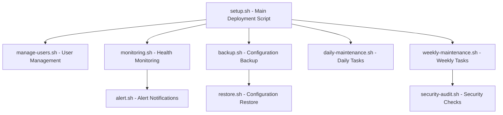
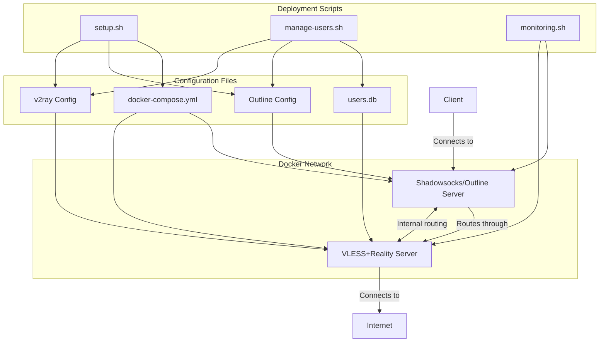
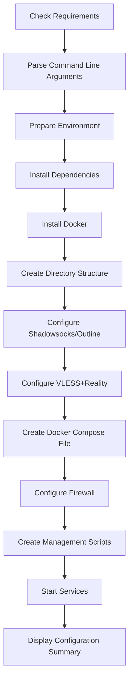
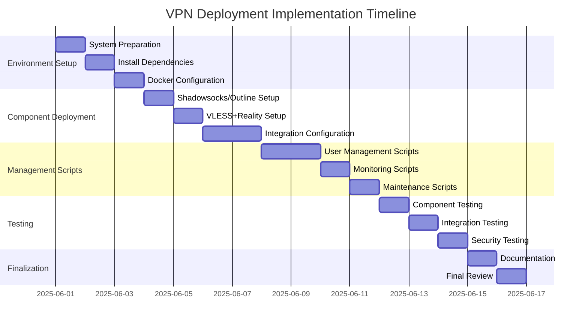

# VPN Deployment Architecture Plan

## 1. Required Deployment Scripts and Their Purposes

### Main Scripts:

1. **setup.sh**
   - Purpose: Main deployment script that orchestrates the entire installation process
   - Responsibilities: System preparation, dependency installation, Docker setup, component configuration, network setup, and service launch

2. **manage-users.sh**
   - Purpose: Unified user management across both Shadowsocks/Outline and VLESS+Reality systems
   - Responsibilities: Add/remove/list users, generate client configurations, export connection details

3. **monitoring.sh**
   - Purpose: System health monitoring and performance metrics collection
   - Responsibilities: Check service status, resource usage, connection counts, log analysis, and alert generation

4. **backup.sh**
   - Purpose: Regular backup of all configuration files and user data
   - Responsibilities: Create timestamped backups, compress configurations, manage backup rotation

5. **daily-maintenance.sh**
   - Purpose: Execute daily maintenance tasks
   - Responsibilities: Log rotation, check disk space, verify service health

6. **weekly-maintenance.sh**
   - Purpose: Execute weekly maintenance tasks
   - Responsibilities: Update Docker images, apply system updates, performance optimization

7. **security-audit.sh**
   - Purpose: Perform security audits and verification
   - Responsibilities: Check logs for suspicious activities, verify file permissions, test for vulnerabilities

8. **restore.sh**
   - Purpose: Restore system from backups
   - Responsibilities: Extract backup archives, replace configuration files, restart services

9. **alert.sh**
   - Purpose: Send alerts when issues are detected
   - Responsibilities: Email/SMS notifications, log alert events

## 2. Component Dependencies and Relationships

### Core Components:

1. **Shadowsocks/Outline Server**
   - First-layer proxy providing initial encryption
   - Handles user authentication for the first layer
   - Obfuscates traffic using HTTP plugin

2. **VLESS+Reality Server**
   - Second-layer proxy with TLS simulation and fingerprinting evasion
   - Handles advanced routing based on content type
   - Connects to the actual Internet destinations

3. **Docker Network**
   - Isolated bridge network (172.16.238.0/24)
   - Static IP assignment for reliable routing
   - Security boundary between containers

4. **Configuration Files**
   - `docker-compose.yml`: Container orchestration and network configuration
   - `config.json` (Shadowsocks): Protocol settings, obfuscation configuration
   - `config.json` (v2ray): VLESS+Reality settings, routing rules
   - `users.db`: Centralized user management database

5. **Scripts Dependencies**
   - setup.sh → All other scripts and configurations
   - manage-users.sh → User database and both service configurations
   - monitoring.sh → Service health checks and metrics
   - All maintenance scripts → Docker and system commands

## 3. Key Functions for Each Script

### setup.sh

**Key Functions:**
- System compatibility check
- Command line argument parsing
- Environment preparation
- Dependencies installation
- Docker installation and configuration
- Directory structure creation
- Shadowsocks/Outline Server configuration
- VLESS+Reality configuration
- Docker Compose file creation
- Firewall configuration
- Management scripts creation
- Service startup
- Configuration summary

### manage-users.sh

**Key Functions:**
- List all users across both systems
- Add new users to both Shadowsocks and VLESS+Reality
- Remove users from both systems
- Export client configurations (including QR codes)
- Display connection instructions
- Service restart after user modifications
- Handle user-specific parameters (name, password, etc.)

### monitoring.sh

**Key Functions:**
- Check Docker service status
- Verify container health
- Monitor system resources (CPU, RAM, disk)
- Track connection counts
- Analyze logs for errors
- Test network connectivity
- Generate alerts on issues
- Maintain performance metrics
- Log rotation
- Send notifications when thresholds are exceeded

### backup.sh

**Key Functions:**
- Create timestamped backups
- Backup all configuration files
- Backup user database
- Compress backup files
- Manage backup retention
- Verify backup integrity
- Schedule regular backups via cron

### maintenance scripts

**Key Functions:**
- Log rotation and cleanup
- Docker image updates
- System package updates
- Performance optimization
- Security checks
- Configuration verification
- Database maintenance
- Certificate/key rotation (if applicable)
- Network optimization

## 4. Environment Requirements and Prerequisites

### Hardware Requirements

| Resource | x86_64 (Minimum) | ARM64 (Minimum) | ARMv7 (Minimum) | Recommended |
|----------|------------------|-----------------|-----------------|-------------|
| CPU      | 2+ cores         | 2+ cores        | 4+ cores        | 4+ cores    |
| RAM      | 2 GB             | 2 GB            | 1 GB            | 4+ GB       |
| Disk     | 20 GB            | 16 GB           | 8 GB            | 40+ GB      |
| Network  | 100 Mbps         | 100 Mbps        | 100 Mbps        | 1 Gbps      |

### Software Requirements

1. **Operating System**
   - Modern Linux distribution (Ubuntu 20.04+ recommended)
   - Kernel 5.4+ for optimal network performance

2. **Required Packages**
   - Docker and Docker Compose
   - UFW (Uncomplicated Firewall)
   - bash, jq, curl, socat, netstat
   - Optional: mailutils (for email alerts)

3. **Network Requirements**
   - Open ports: 8388 (Shadowsocks) and 443 (VLESS+Reality)
   - Unrestricted outbound internet access
   - Public IP address (static IP recommended)
   - Proper DNS resolution

4. **Architecture-Specific Requirements**
   - For ARM64: ARM-compatible Docker images
   - For ARMv7: Specialized memory optimizations

5. **Security Requirements**
   - Non-root user with sudo privileges
   - SSH access with key-based authentication
   - Firewall properly configured
   - Regular security updates

## 5. Security Considerations

### System Security

1. **Server Hardening**
   - Minimal service exposure (only SSH and VPN ports)
   - Regular security updates
   - SSH hardening (disable password auth, change default port)
   - Proper file permissions (especially for configuration and key files)
   - Firewall with strict allow/deny rules

2. **Docker Security**
   - Container resource limits
   - Non-privileged containers where possible
   - Isolated Docker network
   - Regular Docker image updates
   - Principle of least privilege for container capabilities

### Authentication and Access Control

1. **User Management**
   - Secure password generation and storage
   - Two-layer authentication (one per protocol)
   - Individual credentials for each layer
   - Regular credential rotation
   - Access policies and restrictions

2. **Key Management**
   - Secure Reality keypair generation and storage
   - Regular key rotation
   - Restricted access to private keys

### Traffic Security

1. **Encryption**
   - Multi-layer encryption (Shadowsocks + VLESS+Reality)
   - Strong ciphers (ChaCha20-IETF-Poly1305 for Shadowsocks)
   - TLS fingerprinting evasion through Reality protocol

2. **Obfuscation**
   - HTTP obfuscation for Shadowsocks traffic
   - Reality protocol mimicking legitimate sites
   - Content-specific routing for different traffic types

3. **Network Isolation**
   - Docker network isolation
   - Restricted internal communication
   - Firewall rules to prevent direct access to internal components

### Operational Security

1. **Monitoring and Alerting**
   - Regular log analysis for suspicious activities
   - Connection monitoring for unusual patterns
   - Resource usage monitoring to detect abnormal behavior
   - Alert system for immediate notification of issues

2. **Backup and Recovery**
   - Regular configuration backups
   - Secure backup storage
   - Tested recovery procedures
   - Version control for configuration files

3. **Update Management**
   - Regular software updates
   - Controlled update process with testing
   - Rollback procedures for failed updates
   - Security patch management

## 6. Implementation Plan and Timeline

The complete implementation is estimated to take approximately 16 days of development time.

## 7. Testing Strategy

1. **Component Testing**
   - Verify each Docker container starts and runs correctly
   - Test configuration validation and error handling
   - Validate user management operations

2. **Integration Testing**
   - Test traffic flow from client → Shadowsocks → VLESS+Reality → Internet
   - Verify content-based routing with different traffic types
   - Test fail-over and recovery mechanisms

3. **Performance Testing**
   - Measure connection throughput and latency
   - Test with multiple concurrent connections
   - Simulate various network conditions

4. **Security Testing**
   - Verify encryption effectiveness
   - Test obfuscation against DPI systems
   - Validate firewall rules and access controls
   - Attempt unauthorized access detection