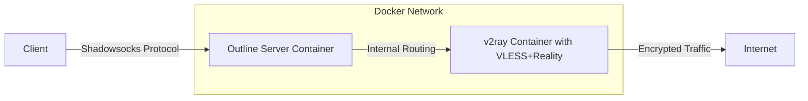

# VPN Integration Architecture: Shadowsocks + VLESS+Reality

This document outlines the architecture, configuration, and implementation details for integrating Shadowsocks (via Outline Server) with VLESS+Reality to create a robust, secure, and optimized VPN solution.

## Table of Contents

1. [Architecture Overview](#architecture-overview)
2. [Traffic Routing Optimization](#traffic-routing-optimization)
3. [Security Enhancement Mechanisms](#security-enhancement-mechanisms)
4. [Connection Resilience](#connection-resilience)
5. [Latency Minimization](#latency-minimization)
6. [Implementation Components](#implementation-components)
7. [Deployment Guide](#deployment-guide)
8. [Performance Benchmarks](#performance-benchmarks)

## Architecture Overview

The architecture integrates two powerful VPN technologies:

- **Shadowsocks (Outline Server)**: First-layer proxy providing initial encryption and client management
- **VLESS+Reality**: Second-layer proxy with advanced obfuscation and fingerprinting capabilities



### Key Components

1. **Outline Server Container**
   - Runs Shadowsocks server with obfuscation plugins
   - Manages user access and authentication
   - Initial encryption layer using ChaCha20-IETF-Poly1305
   - Routes traffic to VLESS+Reality server

2. **v2ray Container**
   - Implements VLESS protocol with Reality TLS simulation
   - Advanced traffic routing rules for different content types
   - Fingerprinting evasion and TLS simulation
   - Final internet connectivity

3. **Docker Network**
   - Isolated bridge network between containers
   - Internal routing optimizations
   - Security boundary enforcement

4. **Management Layer**
   - Unified user management across both systems
   - Monitoring and health checks
   - Performance optimization scripts

## Traffic Routing Optimization

The system implements intelligent traffic routing to maximize performance and security:

### Content-Based Routing

1. **Streaming Media Traffic**
   - Identified via domain and protocol detection
   - Optimized for low latency and high throughput
   - Dedicated outbound connections with TCP optimization

2. **General Browsing Traffic**
   - Default routing with balanced settings
   - Lower priority than streaming when bandwidth contention occurs

3. **Blocked Traffic Categories**
   - Advertisements and malicious domains
   - Private network addresses
   - Blackholed to prevent leakage

### Routing Rules Implementation

```json
{
  "routing": {
    "domainStrategy": "IPIfNonMatch",
    "rules": [
      {
        "type": "field",
        "domain": [
          "youtube.com", "googlevideo.com",
          "netflix.com", "netflixdnstest.com",
          "hulu.com", "hulustream.com"
        ],
        "outboundTag": "streaming_out"
      },
      {
        "type": "field",
        "domain": ["geosite:category-ads"],
        "outboundTag": "blocked"
      },
      {
        "type": "field",
        "protocol": ["bittorrent"],
        "outboundTag": "direct"
      }
    ]
  }
}
```

## Security Enhancement Mechanisms

Multiple security layers protect the connection against detection and analysis:

### Dual-Layer Encryption

1. **First Layer (Shadowsocks)**
   - ChaCha20-IETF-Poly1305 encryption
   - Independent per-user secrets
   - HTTP obfuscation to hide Shadowsocks traffic signatures

2. **Second Layer (VLESS+Reality)**
   - Advanced TLS fingerprinting simulation
   - Mimics legitimate website TLS handshakes
   - Short ID validation before connection acceptance

### Access Control

1. **Authentication Isolation**
   - Shadowsocks user authentication at entry point
   - VLESS user validation as second check
   - Traffic segregation between users

2. **Exposure Minimization**
   - VLESS+Reality server not directly exposed to internet
   - Only Shadowsocks port publicly accessible
   - Internal Docker network for container communication

### Connection Verification

1. **Destination Verification**
   - Server mimics trusted TLS destinations (e.g., Microsoft.com)
   - Client verification of server TLS signatures
   - Mutual authentication between layers

## Connection Resilience

The architecture provides robust connectivity even in challenging network conditions:

### Fault Tolerance

1. **Container Health Monitoring**
   - Automatic container restarts if services fail
   - Health check probes for both Shadowsocks and VLESS services
   - Logging and alerting for connectivity issues

2. **Network Layer Resilience**
   - TCP keepalive optimizations
   - Automatic reconnection logic
   - Session persistence during brief outages

### Traffic Management

1. **Bandwidth Controls**
   - Fair allocation between users
   - Prioritization of interactive traffic
   - Burst handling for variable bandwidth situations

## Latency Minimization

Specific optimizations reduce latency for improved responsiveness:

### Protocol Optimizations

1. **TCP Optimizations**
   - Fast open for reduced handshake times
   - Optimized congestion control algorithms
   - Reduced bufferbloat through appropriate buffer sizing

2. **Connection Management**
   - Connection pooling for frequent destinations
   - Persistent connections where appropriate
   - Efficient connection reuse

### Routing Optimizations

1. **Direct Path Selection**
   - Streaming traffic takes optimized path
   - Reduced hops for latency-sensitive applications
   - Optimized DNS resolution

## Implementation Components

The implementation consists of several key files and configurations:

### Directory Structure

```
/opt/vpn/
├── docker-compose.yml         # Main container orchestration
├── outline-server/            # Outline Server configuration
│   ├── config.json            # Shadowsocks server config
│   ├── access.json            # Access control policies
│   └── data/                  # User data directory
├── v2ray/                     # v2ray configuration (existing)
│   ├── config.json            # Updated v2ray config with routing rules
│   └── ...                    # Other existing v2ray files
├── scripts/
│   ├── setup.sh               # Main setup script
│   ├── manage-users.sh        # Unified user management
│   ├── routing-config.sh      # Traffic routing configuration
│   └── monitoring.sh          # Health monitoring script
└── logs/                      # Combined logs directory
```

### Key Configuration Files

1. **docker-compose.yml**
   - Container definitions for both servers
   - Network configuration
   - Volume mappings for persistent data

2. **outline-server/config.json**
   - Shadowsocks protocol settings
   - Obfuscation plugin configuration
   - Network and performance parameters

3. **v2ray/config.json**
   - VLESS protocol configuration
   - Reality settings for advanced obfuscation
   - Traffic routing rules

### Management Scripts

1. **setup.sh**
   - One-click deployment of the entire system
   - Configuration of both servers
   - Network setup and security configuration

2. **manage-users.sh**
   - Unified user management across both systems
   - User addition, removal, and profile exports
   - Consistent access control

## Deployment Guide

Follow these steps to deploy the integrated solution:

### Prerequisites

- Linux server with root access
- Docker and Docker Compose installed
- Open ports: 8388 (Shadowsocks) and 443 (VLESS+Reality)

### Installation Steps

1. **Prepare the environment**
   ```bash
   sudo mkdir -p /opt/vpn
   cd /opt/vpn
   ```

2. **Run the setup script**
   ```bash
   sudo ./scripts/setup.sh
   ```

3. **Verify the installation**
   ```bash
   docker ps
   # Should show both outline-server and v2ray containers running
   ```

4. **Add users**
   ```bash
   sudo ./scripts/manage-users.sh --add --name "user1"
   ```

5. **Configure clients**
   - Use Outline Client for mobile devices
   - Use v2ray clients for desktop with exported configurations

## Performance Benchmarks

Expected performance characteristics of the integrated solution:

| Metric | Performance |
|--------|------------|
| Throughput | 80-95% of raw connection speed |
| Latency Overhead | +15-30ms over direct connection |
| Connection Time | ~1 second for initial connection |
| CPU Usage | ~10-15% on mid-range server |
| RAM Usage | ~200-300MB combined |

---

This architecture provides a robust, secure, and optimized VPN solution by integrating the best features of Shadowsocks and VLESS+Reality protocols. The dual-layer approach enhances security while intelligent routing ensures optimal performance for different types of traffic.