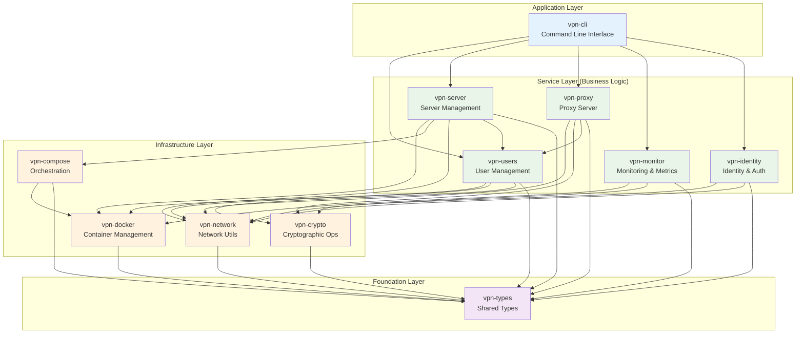
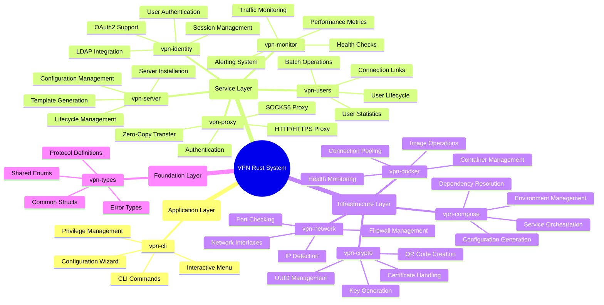
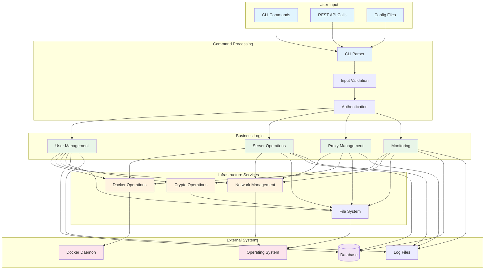
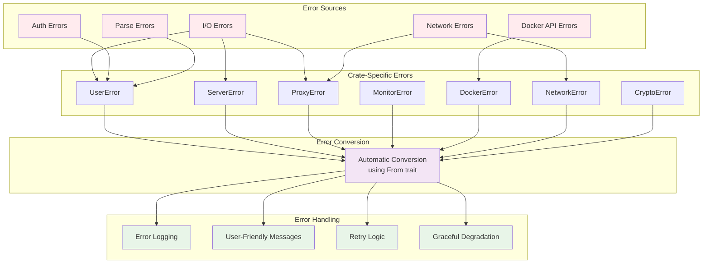

# Crate Architecture & Dependencies

## Rust Workspace Crate Structure

```mermaid
graph TB
    subgraph "Application Layer"
        CLI[vpn-cli<br/>Command Line Interface]
    end

    subgraph "Service Layer (Business Logic)"
        USR[vpn-users<br/>User Management]
        SRV[vpn-server<br/>Server Management]
        PRX[vpn-proxy<br/>Proxy Server]
        MON[vpn-monitor<br/>Monitoring & Metrics]
        IDT[vpn-identity<br/>Identity & Auth]
    end

    subgraph "Infrastructure Layer"
        DCK[vpn-docker<br/>Container Management]
        CMP[vpn-compose<br/>Orchestration]
        NET[vpn-network<br/>Network Utils]
        CRY[vpn-crypto<br/>Cryptographic Ops]
    end

    subgraph "Foundation Layer"
        TYP[vpn-types<br/>Shared Types]
    end

    %% Application Layer Dependencies
    CLI --> USR
    CLI --> SRV
    CLI --> PRX
    CLI --> MON
    CLI --> IDT

    %% Service Layer Dependencies
    USR --> DCK
    USR --> NET
    USR --> CRY
    USR --> TYP

    SRV --> DCK
    SRV --> CMP
    SRV --> NET
    SRV --> USR
    SRV --> TYP

    PRX --> NET
    PRX --> CRY
    PRX --> USR
    PRX --> TYP

    MON --> DCK
    MON --> NET
    MON --> TYP

    IDT --> CRY
    IDT --> NET
    IDT --> TYP

    %% Infrastructure Layer Dependencies
    DCK --> TYP
    CMP --> DCK
    CMP --> TYP
    NET --> TYP
    CRY --> TYP

    style CLI fill:#e3f2fd
    style USR fill:#e8f5e8
    style SRV fill:#e8f5e8
    style PRX fill:#e8f5e8
    style MON fill:#e8f5e8
    style IDT fill:#e8f5e8
    style DCK fill:#fff3e0
    style CMP fill:#fff3e0
    style NET fill:#fff3e0
    style CRY fill:#fff3e0
    style TYP fill:#f3e5f5
```

## Detailed Crate Responsibilities

```mermaid
mindmap
  root((VPN Rust System))
    (Application Layer)
      vpn-cli
        CLI Commands
        Interactive Menu
        Privilege Management
        Configuration Wizard
    (Service Layer)
      vpn-users
        User Lifecycle
        Connection Links
        Batch Operations
        User Statistics
      vpn-server
        Server Installation
        Configuration Management
        Lifecycle Management
        Template Generation
      vpn-proxy
        HTTP/HTTPS Proxy
        SOCKS5 Proxy
        Authentication
        Zero-Copy Transfer
      vpn-monitor
        Traffic Monitoring
        Health Checks
        Alerting System
        Performance Metrics
      vpn-identity
        User Authentication
        LDAP Integration
        OAuth2 Support
        Session Management
    (Infrastructure Layer)
      vpn-docker
        Container Management
        Health Monitoring
        Connection Pooling
        Image Operations
      vpn-compose
        Service Orchestration
        Configuration Generation
        Environment Management
        Dependency Resolution
      vpn-network
        Firewall Management
        Port Checking
        IP Detection
        Network Interfaces
      vpn-crypto
        Key Generation
        QR Code Creation
        UUID Management
        Certificate Handling
    (Foundation Layer)
      vpn-types
        Protocol Definitions
        Shared Enums
        Common Structs
        Error Types
```

## Data Flow Architecture

```mermaid
flowchart TD
    subgraph "User Input"
        CMD[CLI Commands]
        API[REST API Calls]
        CFG[Config Files]
    end

    subgraph "Command Processing"
        CLI[CLI Parser]
        VAL[Input Validation]
        AUTH[Authentication]
    end

    subgraph "Business Logic"
        USR[User Management]
        SRV[Server Operations]
        PRX[Proxy Management]
        MON[Monitoring]
    end

    subgraph "Infrastructure Services"
        DCK[Docker Operations]
        NET[Network Management]
        CRY[Crypto Operations]
        FS[File System]
    end

    subgraph "External Systems"
        DOCKER[Docker Daemon]
        OS[Operating System]
        DB[(Database)]
        LOG[Log Files]
    end

    %% Input flow
    CMD --> CLI
    API --> CLI
    CFG --> CLI

    %% Processing flow
    CLI --> VAL
    VAL --> AUTH
    AUTH --> USR
    AUTH --> SRV
    AUTH --> PRX
    AUTH --> MON

    %% Business logic flow
    USR --> DCK
    USR --> NET
    USR --> CRY
    USR --> FS

    SRV --> DCK
    SRV --> NET
    SRV --> FS

    PRX --> NET
    PRX --> CRY
    PRX --> FS

    MON --> DCK
    MON --> NET
    MON --> FS

    %% Infrastructure flow
    DCK --> DOCKER
    NET --> OS
    CRY --> FS
    FS --> OS

    %% Data persistence
    USR --> DB
    SRV --> DB
    MON --> DB
    USR --> LOG
    SRV --> LOG
    PRX --> LOG
    MON --> LOG

    style CMD fill:#e1f5fe
    style API fill:#e1f5fe
    style CFG fill:#e1f5fe
    style CLI fill:#e3f2fd
    style USR fill:#e8f5e8
    style SRV fill:#e8f5e8
    style PRX fill:#e8f5e8
    style MON fill:#e8f5e8
    style DCK fill:#fff3e0
    style NET fill:#fff3e0
    style CRY fill:#fff3e0
    style DOCKER fill:#fce4ec
    style OS fill:#fce4ec
    style DB fill:#f3e5f5
```

## Error Handling Flow

```mermaid
graph TD
    subgraph "Error Sources"
        IO[I/O Errors]
        NET[Network Errors]
        DOCKER[Docker API Errors]
        AUTH[Auth Errors]
        PARSE[Parse Errors]
    end

    subgraph "Crate-Specific Errors"
        UE[UserError]
        SE[ServerError]
        PE[ProxyError]
        ME[MonitorError]
        DE[DockerError]
        NE[NetworkError]
        CE[CryptoError]
    end

    subgraph "Error Conversion"
        CONV[Automatic Conversion<br/>using From trait]
    end

    subgraph "Error Handling"
        LOG[Error Logging]
        USER[User-Friendly Messages]
        RETRY[Retry Logic]
        FALLBACK[Graceful Degradation]
    end

    %% Error flow
    IO --> UE
    IO --> SE
    IO --> PE
    NET --> NE
    NET --> PE
    DOCKER --> DE
    AUTH --> UE
    PARSE --> UE

    %% Conversion
    UE --> CONV
    SE --> CONV
    PE --> CONV
    ME --> CONV
    DE --> CONV
    NE --> CONV
    CE --> CONV

    %% Handling
    CONV --> LOG
    CONV --> USER
    CONV --> RETRY
    CONV --> FALLBACK

    style IO fill:#ffebee
    style NET fill:#ffebee
    style DOCKER fill:#ffebee
    style AUTH fill:#ffebee
    style PARSE fill:#ffebee
    style CONV fill:#f3e5f5
    style LOG fill:#e8f5e8
    style USER fill:#e8f5e8
    style RETRY fill:#e8f5e8
    style FALLBACK fill:#e8f5e8
```