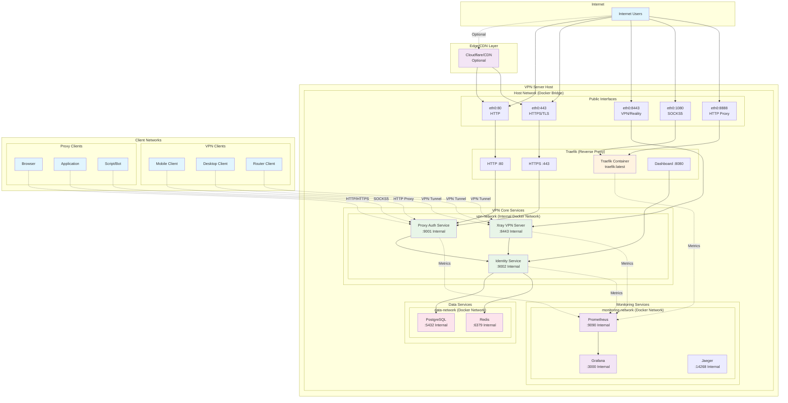
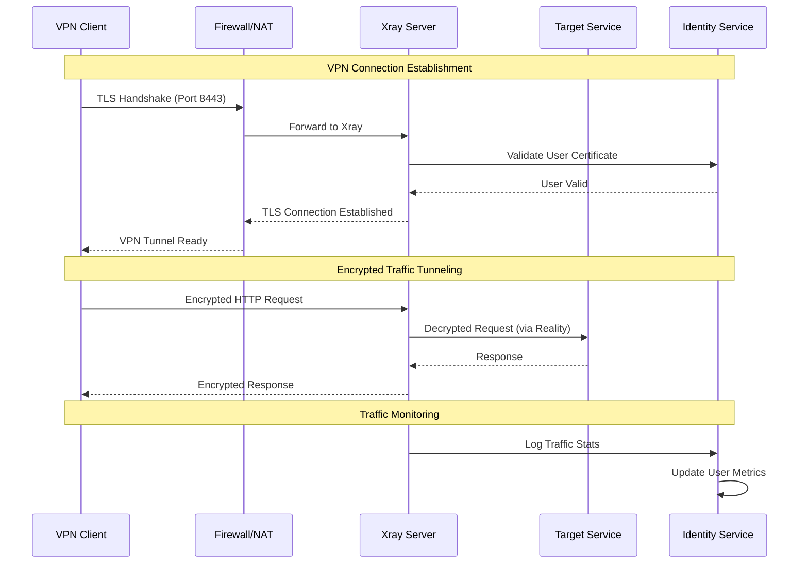
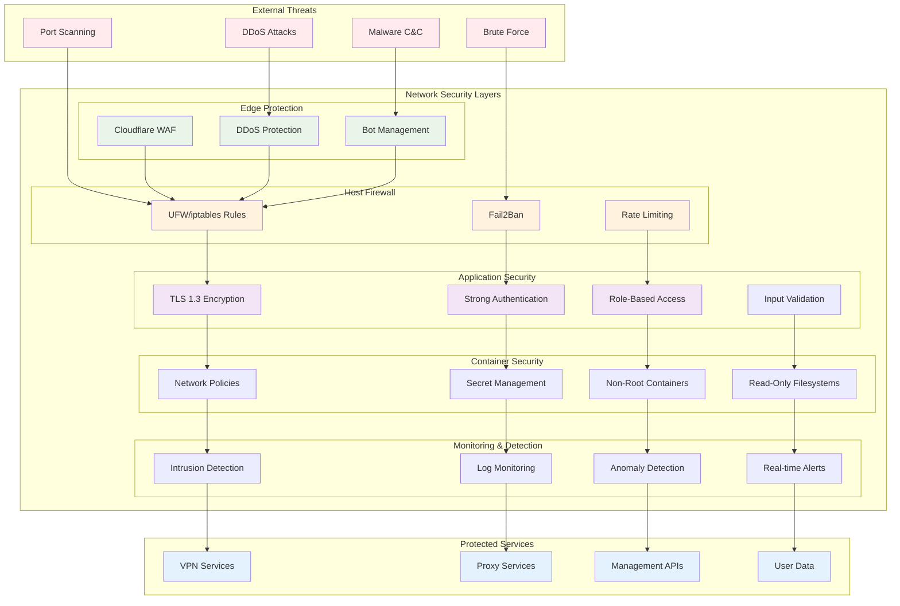

# Network Topology & Traffic Flow

## Network Topology Overview



## Traffic Flow Patterns

### VPN Traffic Flow (VLESS+Reality)



### Proxy Traffic Flow (HTTP/SOCKS5)

```mermaid
sequenceDiagram
    participant PC as Proxy Client
    participant TR as Traefik
    participant PA as Proxy Auth
    participant IS as Identity Service
    participant TS as Target Service

    Note over PC,TS: HTTP Proxy Request
    PC->>TR: HTTP CONNECT example.com:443
    TR->>PA: Forward Proxy Request
    PA->>IS: Authenticate User
    IS-->>PA: Auth Success/Failure
    
    alt Authentication Success
        PA->>TS: Establish Connection
        TS-->>PA: Connection Established
        PA-->>TR: 200 Connection Established
        TR-->>PC: Tunnel Ready
        PC<->>TS: Direct Encrypted Traffic
    else Authentication Failure
        PA-->>TR: 407 Proxy Authentication Required
        TR-->>PC: Auth Error
    end

    Note over PC,TS: SOCKS5 Proxy Request
    PC->>TR: SOCKS5 CONNECT example.com:443
    TR->>PA: Forward SOCKS5 Request
    PA->>IS: Authenticate User
    IS-->>PA: Auth Result
    PA->>TS: Establish Connection
    TS-->>PA: Connection Established
    PA-->>PC: SOCKS5 Success
    PC<->>TS: Proxied Traffic via PA
```

## Network Security Architecture



## Port Configuration & Firewall Rules

```mermaid
graph TB
    subgraph "External Ports (Public)"
        P80[Port 80<br/>HTTP Redirect]
        P443[Port 443<br/>HTTPS/TLS]
        P8443[Port 8443<br/>VPN/Reality]
        P1080[Port 1080<br/>SOCKS5 Proxy]
        P8888[Port 8888<br/>HTTP Proxy]
        P8080[Port 8080<br/>Traefik Dashboard]
    end

    subgraph "Internal Ports (Docker Networks)"
        PI9001[Port 9001<br/>Proxy Auth Service]
        PI9002[Port 9002<br/>Identity Service]
        PI5432[Port 5432<br/>PostgreSQL]
        PI6379[Port 6379<br/>Redis]
        PI9090[Port 9090<br/>Prometheus]
        PI3000[Port 3000<br/>Grafana]
        PI14268[Port 14268<br/>Jaeger]
    end

    subgraph "Firewall Rules"
        FR1[Allow 80,443 from anywhere]
        FR2[Allow 8443 from anywhere]
        FR3[Allow 1080,8888 from anywhere]
        FR4[Allow 8080 from admin IPs only]
        FR5[Deny all other external ports]
        FR6[Allow inter-container communication]
        FR7[Rate limit per IP: 100 req/min]
        FR8[Block known malicious IPs]
    end

    %% Port associations
    P80 --> FR1
    P443 --> FR1
    P8443 --> FR2
    P1080 --> FR3
    P8888 --> FR3
    P8080 --> FR4

    PI9001 --> FR6
    PI9002 --> FR6
    PI5432 --> FR6
    PI6379 --> FR6
    PI9090 --> FR6
    PI3000 --> FR6
    PI14268 --> FR6

    %% Security rules
    FR5 -.-> PI9001
    FR5 -.-> PI9002
    FR5 -.-> PI5432
    FR5 -.-> PI6379

    FR7 --> P80
    FR7 --> P443
    FR7 --> P8443
    FR8 --> FR1
    FR8 --> FR2
    FR8 --> FR3

    style P80 fill:#e8f5e8
    style P443 fill:#e8f5e8
    style P8443 fill:#e8f5e8
    style P1080 fill:#e8f5e8
    style P8888 fill:#e8f5e8
    style P8080 fill:#fff3e0
    style PI9001 fill:#fce4ec
    style PI9002 fill:#fce4ec
    style PI5432 fill:#fce4ec
    style PI6379 fill:#fce4ec
    style PI9090 fill:#fce4ec
    style PI3000 fill:#fce4ec
    style PI14268 fill:#fce4ec
    style FR5 fill:#ffebee
    style FR7 fill:#f3e5f5
    style FR8 fill:#f3e5f5
```

