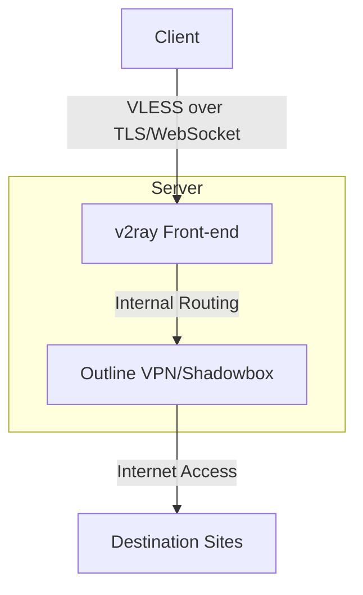
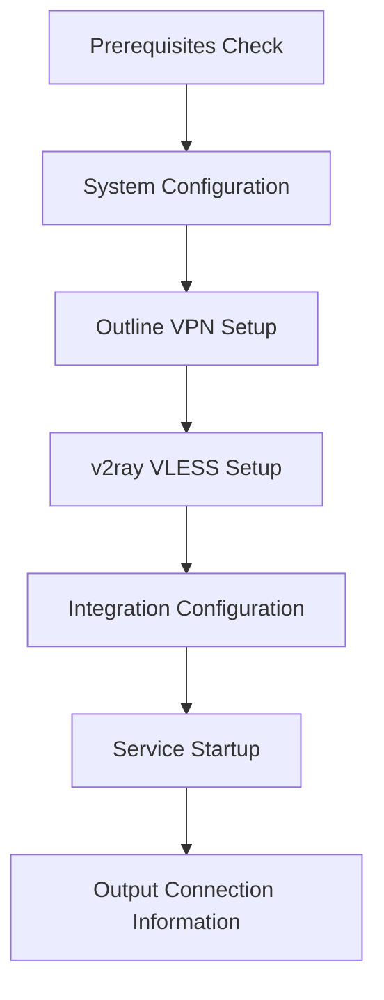

# Outline VPN with v2ray VLESS Masking - Implementation Plan

## Overview

This document outlines the plan for replacing the current Outline VPN installation script with a new implementation that:
1. Removes all monitoring and management components
2. Integrates v2ray with VLESS protocol to mask Outline VPN traffic
3. Simplifies the setup process while enhancing privacy and anti-censorship capabilities

## Architecture Diagram

## Core Components

1. **v2ray with VLESS Protocol**
   - Acts as the front-facing service
   - Implements traffic masking/obfuscation
   - Routes traffic to Outline VPN internally

2. **Outline VPN (Shadowbox)**
   - Runs without management API 
   - Handles actual VPN functionality
   - Communicates only with v2ray internally

## Implementation Plan

### 1. Script Structure and Initialization

1. Maintain license header and basic utility functions from original script
2. Remove management API components
3. Update usage instructions and parameters

### 2. Installation Phases

### 3. Detailed Components

#### Prerequisites Check
- Docker installation verification
- System compatibility check
- Required port availability check

#### System Configuration
- Create necessary directories
- Configure firewall rules
- Generate TLS certificates

#### Outline VPN Setup
- Deploy Shadowbox container without management API
- Configure Shadowbox for internal-only accessibility
- Generate access keys programmatically

#### v2ray VLESS Setup
- Generate v2ray configuration with VLESS protocol
- Configure WebSocket transport for masking
- Set up TLS for secure connections

#### Integration Configuration
- Configure v2ray to route traffic to Outline VPN
- Set up network connectivity between containers
- Implement fallback mechanisms

#### Service Startup
- Start Outline VPN container
- Start v2ray container
- Verify connectivity between services

#### Output Connection Information
- Generate client configuration information
- Provide v2ray VLESS connection details

## Removed Components

- Watchtower container
- Management API
- Monitoring components (Prometheus, Alertmanager, Grafana)
- Web-based management interface

## Technical Specifications

### v2ray VLESS Configuration

- Protocol: VLESS with UUID authentication
- Transport: WebSocket over TLS
- Port: 443 (standard HTTPS port)
- Fallback: Regular website for non-VPN requests

### Outline VPN Configuration

- Protocol: Shadowsocks
- Internal network only (not directly exposed)
- Multiple encryption method support
- No management API

### Security Measures

- TLS encryption for all external traffic
- Network isolation between components
- Minimal attack surface (no management interfaces)
- Regular container updates

## Script Modification Details

1. **Original Script Functions to Keep:**
   - Docker installation helpers
   - Utility functions (log_*, fetch, etc.)
   - Certificate generation
   - Basic command-line parsing

2. **Functions to Remove:**
   - Watchtower setup
   - Management API
   - API URL configuration

3. **New Functions to Add:**
   - v2ray VLESS configuration generator
   - Integration setup between v2ray and Outline
   - Simplified connection info output

4. **Modified Parameters:**
   - Remove API port options
   - Add v2ray configuration options
   - Simplify hostname handling

## Implementation Steps

1. Start with the original script as a base
2. Remove all monitoring and management components
3. Modify Outline VPN setup to work without management API
4. Add v2ray VLESS configuration setup
5. Configure integration between services
6. Update output to provide connection information
7. Test the full implementation

This plan provides a roadmap for completely replacing the current installation script with a more secure, censorship-resistant VPN setup that combines the strengths of Outline VPN and v2ray VLESS protocol.